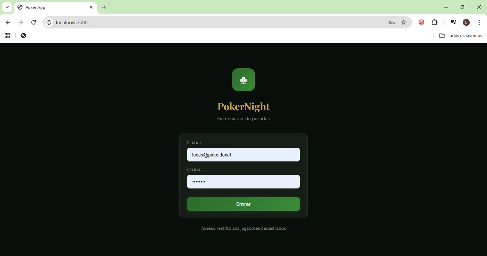
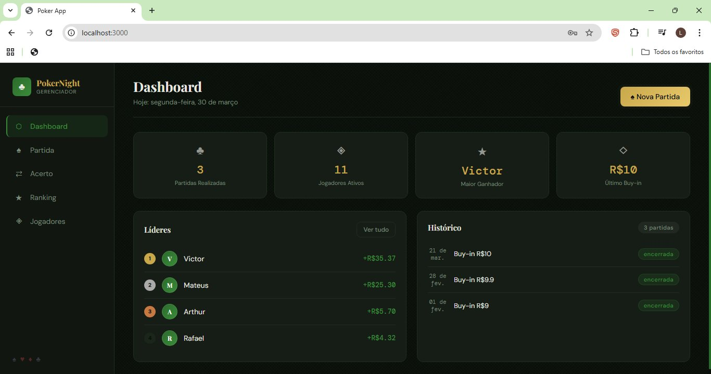
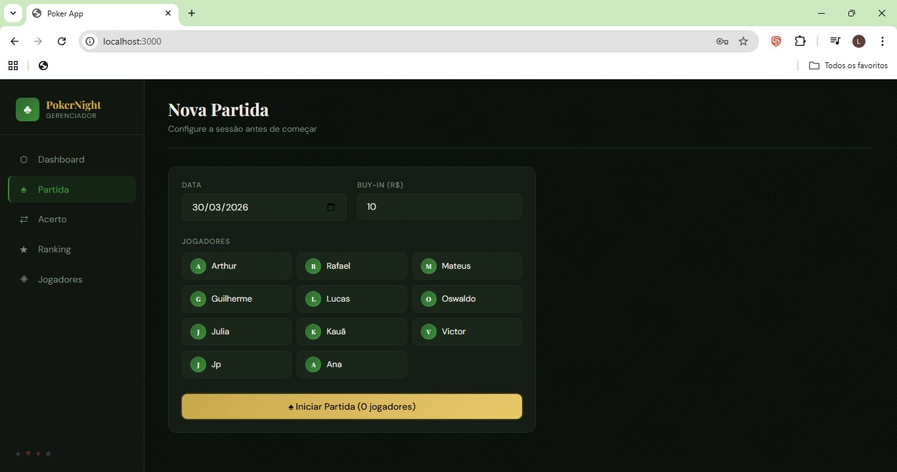
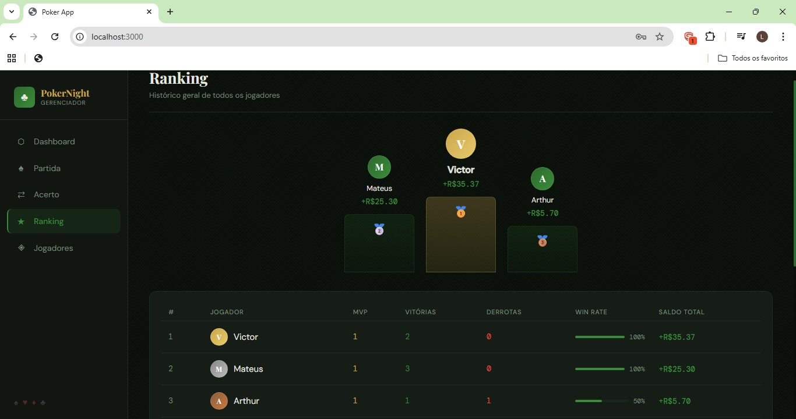

[README_poker.md](https://github.com/user-attachments/files/26361501/README_poker.md)
# PokerNight 🃏

Gerenciador completo de partidas mensais de poker. Sistema full stack com backend em FastAPI, frontend web em React e aplicativo mobile em Flutter.

---

## 📸 Screenshots

> Login · Dashboard · Nova Partida · Ranking · Jogadores

<!-- Substitua os caminhos abaixo pelos prints do projeto no repositório -->
| Login | Dashboard |
|-------|-----------|
|  |  |

| Nova Partida | Ranking |
|--------------|---------|
|  |  |

---

## ✨ Funcionalidades

- 🔐 Autenticação por e-mail e senha (acesso restrito a jogadores cadastrados)
- 🃏 Criação de partidas com data, buy-in e seleção de jogadores
- 💰 Registro de resultado por jogador (lucro/prejuízo)
- 🔄 **Acerto automático** — algoritmo de transferências mínimas para quitar dívidas entre jogadores
- 🏆 Ranking geral com vitórias, derrotas, win rate e saldo total
- 📊 Dashboard com métricas: partidas realizadas, maior ganhador, último buy-in e líderes
- 👥 Cadastro e gerenciamento de jogadores
- 📱 App mobile multiplataforma (Android e iOS) em Flutter

---

## 🛠 Stack

| Camada | Tecnologia |
|--------|-----------|
| Backend | Python 3.11 + FastAPI |
| Frontend Web | React |
| Mobile | Flutter (Dart) |
| Banco de Dados | SQLite |
| API | REST (JSON) |

---

## 🚀 Como rodar localmente

### Pré-requisitos
- Python 3.11+
- Node.js 18+
- Flutter SDK

### Backend
```bash
cd backend
pip install -r requirements.txt
uvicorn main:app --reload
```
API disponível em `http://localhost:8000`

### Frontend Web
```bash
cd frontend
npm install
npm start
```
Acesse `http://localhost:3000`

### App Mobile
```bash
cd mobile
flutter pub get
flutter run
```

---

## 📁 Estrutura do Projeto

```
Poker/
├── backend/        # API REST em FastAPI
├── frontend/       # Interface web em React
└── mobile/         # App Flutter (Android & iOS)
```

---

## 👨‍💻 Autor

**Lucas Rocha de Oliveira**
[github.com/lcslro](https://github.com/lcslro)
