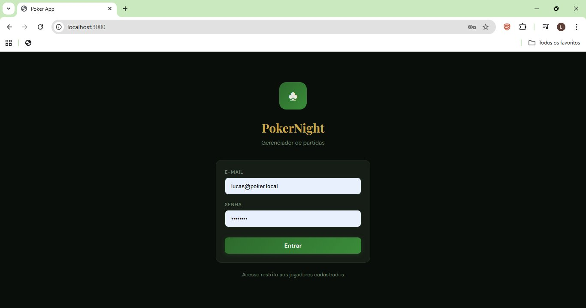
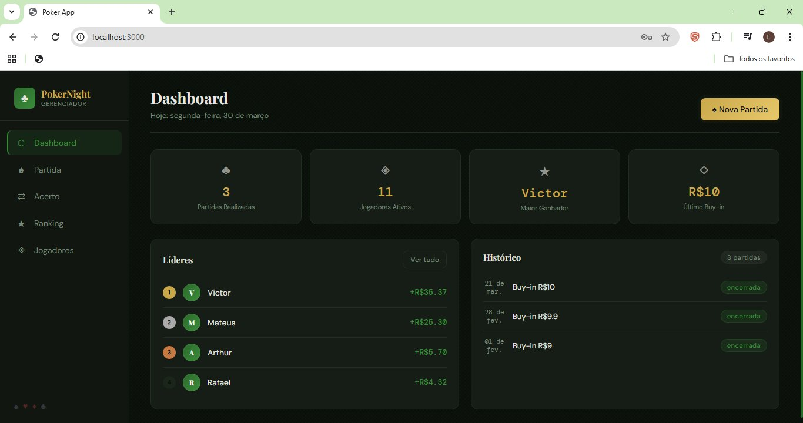
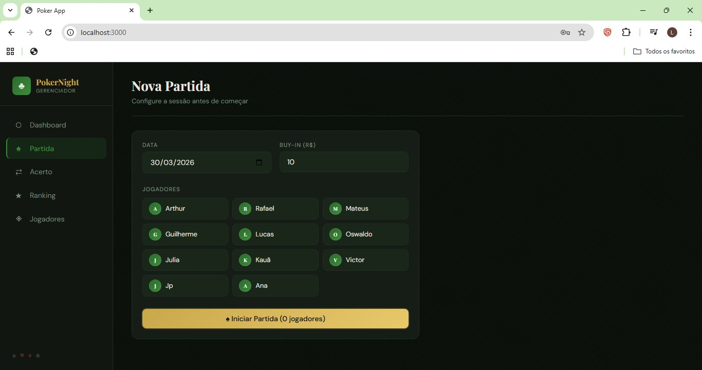
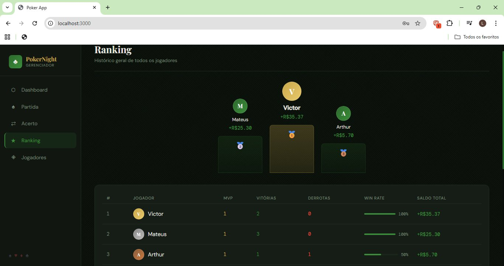
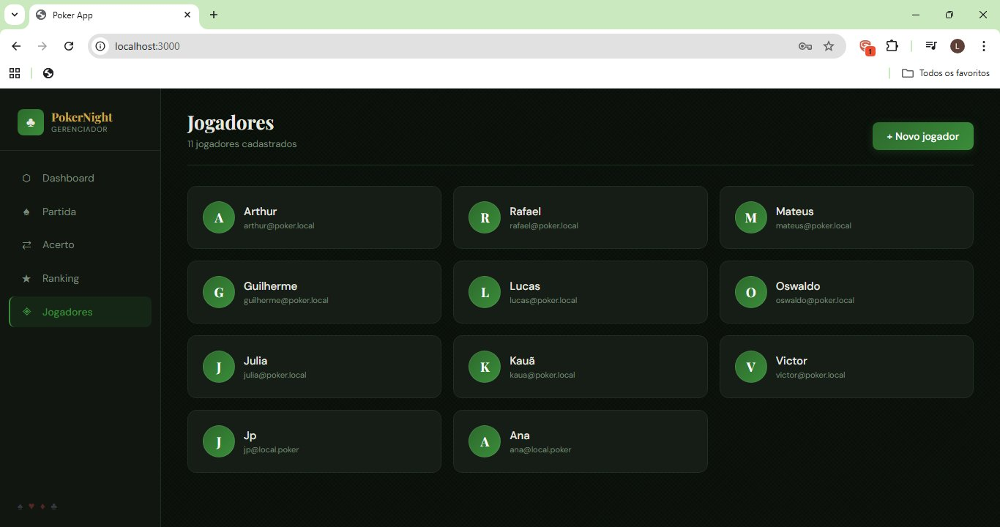
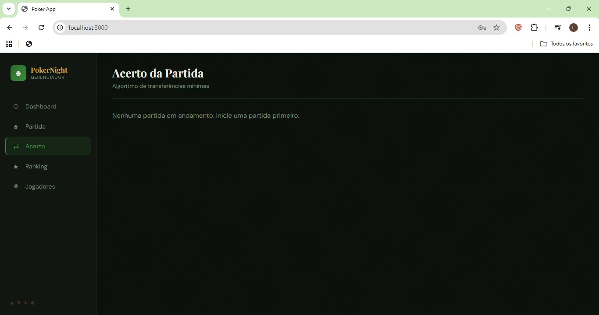

# Poker Manager 🃏

Full-stack poker management platform for monthly home games. FastAPI REST API, React web app and a Flutter mobile application.

---

## Overview

Organizing recurring poker nights usually means spreadsheets and manual math. Poker Manager centralizes everything: players register in the app, matches are created with buy-in and participants, results are recorded per player, and the system calculates who owes whom so debts can be settled with the minimum number of transfers.

## ✨ Features

- 🔐 Email/password authentication (JWT) — access restricted to registered players
- 🃏 Match creation with date, buy-in and player selection
- 💰 Per-player result registration (profit/loss)
- 🔄 **Automatic settlement** — minimum-transfer algorithm to clear debts between players
- 🏆 Overall ranking with wins, losses, win rate and total balance
- 📊 Dashboard with metrics: matches played, biggest winner, last buy-in and leaders
- 👥 Player registration and management
- 📱 Cross-platform mobile app (Android & iOS) built with Flutter

## 🏗 Architecture

```
┌─────────────┐      ┌──────────────────┐      ┌─────────┐
│ React (web) │──────▶│  FastAPI REST API │─────▶│ SQLite  │
└─────────────┘      └──────────────────┘      └─────────┘
┌───────────────┐            ▲
│ Flutter (app) │────────────┘
└───────────────┘
```

- **Backend** — FastAPI REST API (JSON) with JWT authentication, SQLAlchemy models and SQLite persistence
- **Web frontend** — React (Vite) SPA; calls the API through a dev proxy (`/api` → `localhost:8000`)
- **Mobile** — Flutter application consuming the same REST API

## 🛠 Tech Stack

| Layer | Technology |
|-------|-----------|
| Backend | Python 3.11 + FastAPI |
| Frontend Web | React (Vite) |
| Mobile | Flutter (Dart) |
| Database | SQLite |
| API | REST (JSON) |

## 📸 Screenshots

| Login | Dashboard |
|-------|-----------|
|  |  |

| New Match | Ranking |
|--------------|---------|
|  |  |

| Players | Settlement |
|--------|-----------|
|  |  |

## 🚀 How to Run

### Prerequisites
- Python 3.11+
- Node.js 18+
- Flutter SDK

### Backend
```bash
cd backend
pip install -r requirements.txt
uvicorn app.main:app --reload
```
API available at `http://localhost:8000`

### Web Frontend
```bash
cd frontend
npm install
npm run dev
```
Open `http://localhost:3000`

### Mobile App
```bash
cd mobile
flutter pub get
flutter run
```

## 📁 Project Structure

```
Poker/
├── backend/        # FastAPI REST API
│   └── app/
│       ├── routers/    # auth, players, sessions, entries, settle, rankings
│       ├── models.py   # SQLAlchemy models
│       ├── schemas.py  # Pydantic schemas
│       └── database.py # SQLite connection
├── frontend/       # React web interface (Vite)
├── mobile/         # Flutter app (Android & iOS)
└── docs/           # Screenshots
```

## 🔮 Future Improvements

- Automated tests for the settlement algorithm
- CI pipeline for backend and frontend
- Deployment of the API and web app
